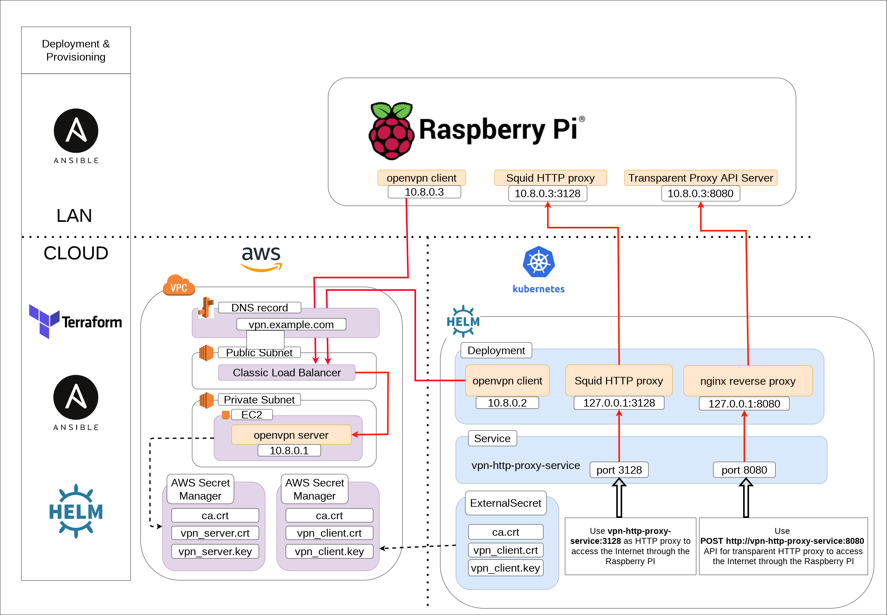

# VPN HTTP proxy

From a Kubernetes cluster on AWS, the idea is to get Internet access through a local Raspberry PI connection rather than through AWS Internet Gateway using an HTTP proxy from an OpenVPN server/client:



This project implements all parts of this architecture:

* AWS ressources:
  *  an OpenVPN server 
  * a Classic Load Balancer
* Raspberry PI resources:
  * an OpenVPN client
  * a Squid HTTP proxy
  * a custom API server written in nodejs to proxify API call (transparent proxy)
* Kubernetes resources (helm):
  * a pod running in a Kubernetes cluster with :
    * openvpn client
    * a second Squid HTTP proxy which proxifies calls to Raspberry PI's HTTP proxy
    * nginx reverse proxy for the api proxy server
  * a kubernetes service redirecting the Squid port and nginx port

Keys are generated using [Easy RSA v3](https://community.openvpn.net/openvpn/wiki/EasyRSA3-OpenVPN-Howto) 

Then, you just need to use the newly created kubernetes service `vpn-http-proxy-service` on port `3128` as HTTP proxy. For example:

```bash
export HTTP_PROXY=http://vpn-http-proxy-service:3128
export HTTPS_PROXY=http://vpn-http-proxy-service:3128
```

All the call will be proxified to the Raspberry PI's Internet connection.

This solution is based on [this Unix stackexchange post](https://unix.stackexchange.com/a/490641/146783)

If you need transparent proxy, you can use nginx reverse proxy port with the following API:

* GET

```bash
POST http://vpn-http-proxy-service:8080
Content-Type: application/json

{
  "method": "GET",
  "url": "https://google.com",
  "headers": {
    "headerName": "headerValue"
  }
}
```
* POST

```bash
POST http://vpn-http-proxy-service:8080
Content-Type: application/json

{
  "method": "POST",
  "url": "https://example.com"
  "data": "{\"field\":\"value\"}",
  "headers": {
    "Content-Type": "application/json",
    "headerName": "headerValue"
  }
}
```
This API is useful for calls that don't support `CONNECT` http method, and it doesn't require to use NAT to redirect traffic on the vpn client pod or via the vpn connection directly.

## Project structure

| directory | description |
|---------|-------|
| aws-vpn-kube-client | helm chart for Open VPN client / Squid HTTP proxy |
| aws-vpn-server | terraform project for deploying OpenVPN server / classic load balancer / AWS secrets... |
| docker-image | docker build of the Open VPN client / Squid docker image |
| easy-rsa | easy rsa scripts used to generate open vpn certificates | 
| api-server-proxy | API http proxy server written in NodeJS |
| gateway-raspberry | ansible playbook used to provision openvpn client, squid & api server on the Raspberry PI |

## 1 - Generate OpenVPN keys :key:

* edit `easy-rsa-init-vars` file with certificate metadata
* edit `.easy-rsa` file if necessary (server & clients name, directory naming...)

```bash
cd easy-rsa
./init-keys.sh
```

## 2 - Deploy AWS infrastructure using terraform

* Update `terraform.tfvars` in `aws-vpn-server/terraform.tfvars`

* Deploy:

```bash
terraform -chdir=aws-vpn-server/ init
terraform -chdir=aws-vpn-server/ plan -var-file="../terraform.tfvars"
terraform -chdir=aws-vpn-server/ apply -var-file="../terraform.tfvars"
```

## 3 - Build & Deploy vpn client docker image :whale2:

Build the docker image under `docker-image`, and push it to your favorite docker registry

```bash
cd docker-image
docker build . -t vpn-http-proxy
docker tag vpn-http-proxy some-repo
docker push some-repo
```

An example for AWS ECR:

```bash
cd docker-image
docker build . -t vpn-http-proxy
aws ecr create-repository --repository-name vpn-http-proxy
repo=$(aws ecr describe-repositories --repository-names vpn-http-proxy | jq -r '.repositories[0].repositoryUri')
docker tag vpn-http-proxy $repo
aws ecr get-login-password | docker login -u AWS --password-stdin $repo
docker push $repo
```

## 4 - Deploy helm chart on your kubernetes cluster

* Update `values.yml` in `aws-vpn-kube-client/values.yml`

* Deploy the chart:

```bash
helm install vpn-client-proxy -n demo aws-vpn-kube-client/helm -f values-custom.yml
```

* If you modify the chart, you would need to upgrade:

```bash
helm upgrade vpn-client-proxy -n demo aws-vpn-kube-client/helm -f values-custom.yml
```

## 5 - Deploy to raspberry PI

On Raspberry PI: 

* add `easy-rsa/easy-rsa-src/ssh/pi_ssh.pub` to authorized_keys file under `.ssh/authorized_keys`

Then:

```bash
./package_api_server.sh
ansible-playbook -i ./gateway-raspberry/hosts -e "vpn_server_host=changeme.example.com"  ./gateway-raspberry/playbook/vpn-http-proxy.yaml
```

## Debug

* Ansible playbook logs on EC2 - Open VPN server

SSM debug log location:

```bash
cat /var/lib/amazon/ssm/[INSTANCE_ID]/document/orchestration/[DOCUMENT_ID]/awsrunShellScript/runShellScript/stdout
```

Run the playbook on the EC2 (for debugging):

```bash
ansible-playbook -i localhost -c local -v -e "SSM=True aws_region=eu-west-3 vpn_keys_server_secret_name=some-secret" vpn-http-proxy.yaml
```

* connect to Raspberry PI

```bash
ssh -i ../easy-rsa/easy-rsa-src/ssh/ec2_ssh pi@raspberrypi.local
```

